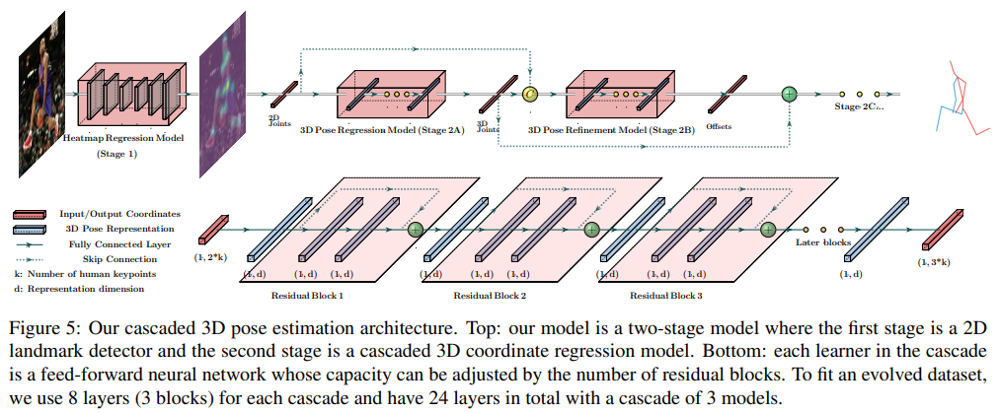

---

##### Download

+ [Paper](paper1.pdf)
<!-- + [Online appendix](appendix1.pdf) -->
+ [Code and data](https://github.com/Nicholasli1995/EvoSkeleton)

---

##### Abstract

End-to-end deep representation learning has achieved remarkable accuracy for monocular 3D human pose estimation, yet these models may fail for unseen poses with limited and fixed training data. This paper proposes a novel data augmentation method that: (1) is scalable for synthesizing massive amount of training data (over 8 million valid 3D human poses with corresponding 2D projections) for training 2D-to-3D networks, (2) can effectively reduce dataset bias. Our method evolves a limited dataset to synthesize unseen 3D human skeletons based on a hierarchical human representation and heuristics inspired by prior knowledge. Extensive experiments show that our approach not only achieves state-of-the-art accuracy on the largest public benchmark, but also generalizes significantly better to unseen and rare poses. Code, pre-trained models and tools are available at this HTTPS URL.

---



---

##### Citation

Li, Shichao, et al. "Cascaded deep monocular 3d human pose estimation with evolutionary training data." Proceedings of the IEEE/CVF conference on computer vision and pattern recognition. 2020.

```BibTeX
@inproceedings{Li_2020,
   title={Cascaded Deep Monocular 3D Human Pose Estimation With Evolutionary Training Data},
   url={http://dx.doi.org/10.1109/CVPR42600.2020.00621},
   DOI={10.1109/cvpr42600.2020.00621},
   booktitle={2020 IEEE/CVF Conference on Computer Vision and Pattern Recognition (CVPR)},
   publisher={IEEE},
   author={Li, Shichao and Ke, Lei and Pratama, Kevin and Tai, Yu-Wing and Tang, Chi-Keung and Cheng, Kwang-Ting},
   year={2020},
   month=jun, pages={6172–6182} }
```

---

<!-- ##### Related material

+ [Presentation slides](presentation1.pdf)
+ [Summary of the paper](https://www.penguinrandomhouse.com/books/110403/unusual-uses-for-olive-oil-by-alexander-mccall-smith/) -->
